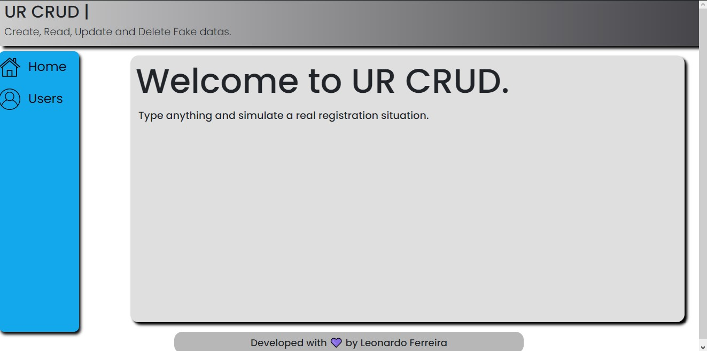
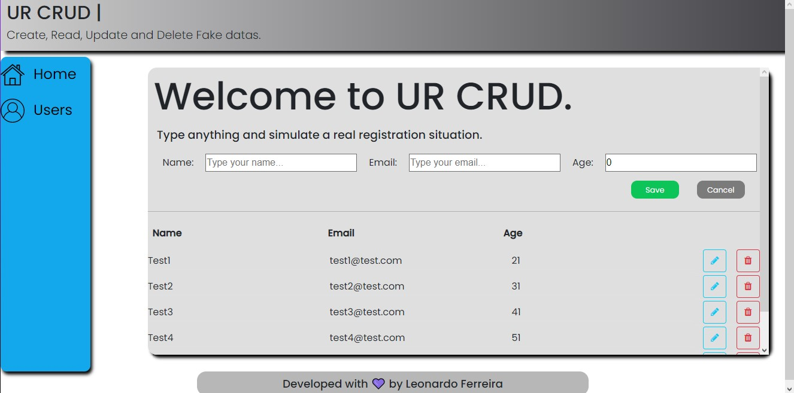

<h1 align="Center"> UR CRUD

# Screenshots:

# The Project

This project helped me a lot to understand how an API REST works and also go deeper in the MERN stack. This is a personal project.

# Technologies

 
&nbsp;
 
&nbsp;

&nbsp;

# Issues

There's a cors problem that i need to fix. THIS PROBLEM DOESN'T DAMAGE THE PROJECT, but need to be fixed. I'm searching the best way fix that. currently i don't know what is about.

# Note

If you want to change something in the project make a pull request. i will accept all feedbacks

# Why i made this

This is a personal project to get a large knowledge about the technologies, this is the first time that i use the MERN Stack.

# How to use

If you want to contribuing with this project make a fork of this project. use this project in your machine you'll need to install the dependecies. To install type: <b> npm i or yarn if you are using yarn</b>. After this enter in each <b>DIR</b> in your terminal and type: <b> npm start </b>. The project is running in PORTS 3000 and 3001

# Dependencies

<a href="https://axios-http.com/docs/intro">Axios</a>  
<a href="https://mongoosejs.com">Mongoose</a>  
<a href="https://www.npmjs.com/package/cors">Cors</a>  
<a href="https://expressjs.com">Express</a>  
<a href="https://reactrouter.com/web/guides/quick-start">React-router-dom</a>  
<a href="https://www.npmjs.com/package/react-spinners">React-spinners</a>  
<a href="https://sass-lang.com">Sass</a>  
<a href="https://fontawesome.com">Font Awesome</a>  
<a href="https://getbootstrap.com">Bootstrap</a>  

# Social

&nbsp;

&nbsp;

# Developed with 💜 by Leonardo Ferreira
